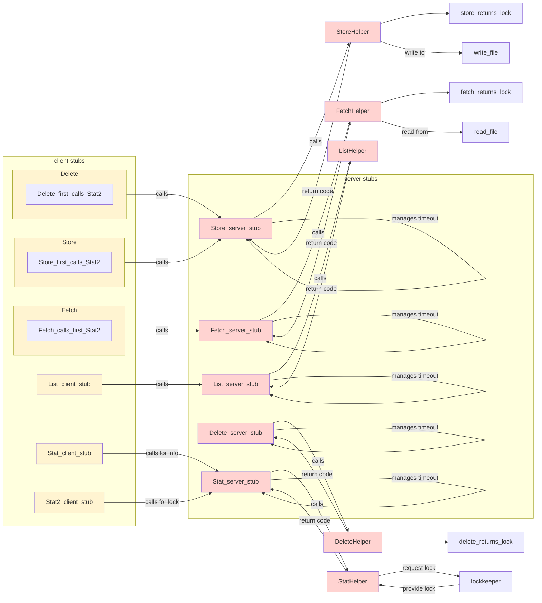

# Project 4 Readme
>A weakly consistent distributed file system.
> File system operations are based on synchronous gRPC (remote procedure call) routines, while file system synchronization is periodically performed as an asynchronous gRPC routine. 
Implemented as student project for Graduate Introduction to Operating Systems (CS 6200).
by Charles Kong.

#
## Contents


#### Part 1: Multi-client DFS with Command-Line Support
[Part 1 Flow of Control](#part-1-flow-of-control) 
[Part 1 Project Understanding](#part-1-project-understanding) 

#### Part 2: Implementing Weak Consistency
[Part 2 Flow of Control](#part-2-flow-of-control) 
[Part 2 Project Understanding](#part-2-project-understanding) 

#### Additional Materials
[Testing](#testing)
[References](#references) 
[Extra Credit](#extra-credit)


# Part 1: Multi-client DFS with Command-Line Support

## Part 1 Flow of Control
###### Jump to >> [Part 1 Flow of Control](#part-1-flow-of-control) // [Part 1 Project Understanding](#part-1-project-understanding) // [Part 2 Flow of Control](#part-2-flow-of-control) // [Part 2 Project Understanding](#part-2-project-understanding) // [Testing](#testing) // [References](#references) // [Extra Credit](#extra-credit)


### Birrell's Remote Procedure Call Interface as Might be Used in a Distributed Filesystem

This implementation is inspired by Birrell's original specification of RPCs. In it, he differentiates between the server stub and the stub implementation. I implement this by simply making each RPC wrap an implementation function. For example, the stub `dfs_service::Fetch()` passes the client request object directly to a corresponding implementor `FetchHelper()`. The top-level wrapper/stub is responsible only for top-level logic, such as gRPC deadline management in Part 1, and synchronization with async gRPC logic in Part 2.

#


## Part 1 Project Understanding


###### Jump to >> [Part 1 Flow of Control](#part-1-flow-of-control) // [Part 1 Project Understanding](#part-1-project-understanding) // [Part 2 Flow of Control](#part-2-flow-of-control) // [Part 2 Project Understanding](#part-2-project-understanding) // [Testing](#testing) // [References](#references) // [Extra Credit](#extra-credit)
### Project Understanding 1: Dealing with Visibility and Access

### Project Understanding 1: gRPC basics
The three essential tasks to builidng a gRPC routine are as follows:
1. Define a service in a .proto file.
2. Generate server and client code using the protocol buffer compiler.
3. Use the C++ gRPC API to write a simple client and server for your service.

The five client-side abstract methods provided by the instructor code can be classified as follows:
||Function Name | gRPC type | lock requirements
|-|:-:|:-:|-|
|| `Stat()`   | unary | no lock
|| `List()`   | unary (no request object) | no lock
|| `Delete()` | unary (no response object) | writer's lock
|| `Fetch()`   | server-streaming | reader's lock
|| `Store()`   | client-streaming | writer's lock

#
### Project Understanding 2: Should `fetch()` require 1 call, 2 calls, or 3 calls?
In any cooperative work relationship, it is a requirement that one must hold an appropriate level of confidence in the other's competence. One who has too little confidence in her teammate may divulge little and instead ask for all the information, intent on getting the job done herself. A colleague who has too much confidence in the other's ability may be inclined to rapidly spew out her request, expecting to be completely understood, only to find herself disappointed in her colleague's result.

It seems that messaging between two nodes in a RPC-driven distributed filesystem follows a similar set of principles. To strike a good balance of caller-callee activity, conversations must contain the right amount of information, based neither on over- or under-reliance, but rather on the proportion of context (i.e. state) and compute power is available to each.

Consider `fetch()` and `store()`, which require a sequence of message exchanges. Several client-side designs are plausible:
  - The 3-call approach: `stat() -> lock() -> fetch()/store()`
  - The 1-call approach: `fetch()/store()`. Server performs stat and lock on its own.
  - The 2-call approach `stat+lock() -> fetch()/store()`

The one-call approach tries to do too much in a single call. This would require heavier messages, not only to send literally two or three calls' worth of information, but also any additional meta-information needed to allow each party to be independently able to come to the same conclusions. 
    
At this point I realized gRPCs are designed to emulate a set of functions that are meant to be sequenced on the client side. The goal is not to make a single gRPC routine into a single, do-it-all application.

*Yet, is the three-call approach as suggested by the project the best we can do?*
The project seemed to imply 1 call to `Stat()`, 1 call to `RequestWriteLock()`, and then one call to `Store()` (or `Fetch()`).

I decided I could get by with just two calls, by grouping `Stat()` and `RequestWriteLock()` into a single function. The rationale behind this was as follows: *The context needed to determine a file's attributes is highly related with the context needed to know whether a lock is needed or not.* 

For example, a `Store()` operation and a writer's lock can be determined by comparing file attributes such as modified times and CRCs. They can be rolled into a single gRPC operation (`Stat2()` in my implementation). It goes as follows: 

1. First, perform `Stat()`. 
2. Then, either preemptively return a return-code (if the client invoked `Stat()`), or continue on in the same function to provision the lock (if the client invoked, for example, `Fetch()`). At this point, the server has now committed the file to the client, and the server trusts the client to make the follow-up call to `Store()` or `Fetch()`. Each of these two functions are designed to release the lock at the end of the call.

In theory, this 2-call approach allows for my design to save roughly a third of the gRPC stub calls made (or one for every three) than the specifications would indicate as required. Finding good metrics to represent these savings should be part of future revisitations of the project.

In principle, this shows there exists an appropriate division of labor in a thoughtfully implemented distributed system. When the number of messages passed can be reduced (in this case, from three exchanges to two), it may indicate a design where the *client* is simply trying to own too much of the process and requesting the server to supply it with very minor computations. 

On the other hand, when two exchanges are unnaturally squashed into one, it may indicate the *server* is trying to own too much of the process. On this other end of the spectrum, the increased amount of logical overhead (in the form of protocol complexity) placed on the server may quietly chip away at any room available for designing a robust, server-centric synchronization protocol, as needed for Part 2 of the project.
#
### Project Understanding 3: Other Considerations    

#### Deadlines
The client supplies `deadline_timeout` in its request, and the server-side gRPC interface manages this.
While the client is interested in evaluating the overall speed of the gRPC call, another purpose of deadline checking is to save on server compute. Therefore, I have the server perform the deadline check both before *and* after the call to the implemented routine.
Interestingly, deadline checking is expected to be performed server-side and not client-side. This seems to imply deadlines are for the client to understand what the server is doing. Realistic clients may cross-validate its own clock against the server's return values.


#### Readers-writer lock
The project specifies only a writer's lock is needed, but isn't sufficient to deal with the common case. A large file implies an equally large likelihood of a partial read of that file. The reader's portion of the lock is simple -- an int-to-string conversion, where the number indicates the number of readers. By using strings as the lock, the writer may continue to use strings (i.e. `client_id`) to place locks. Taking the suggestions in existing code, the lock object is implemented as a mutex-protected map. A sample of the key-value pairs might look as follows:
|std::map key|zero_readers.txt|one_writer.txt|one_reader.txt|seven_readers.txt||
|-|:-:|:-:|:-:|:-:|-|
|std::map value| ""| "mnt/client/client_1" | "1" | "7" ||
||


#
# Part 2: Implementing Weak Consistency
## Part 2 Flow of Control
###### Jump to >> [Part 1 Flow of Control](#part-1-flow-of-control) // [Part 1 Project Understanding](#part-1-project-understanding) // [Part 2 Flow of Control](#part-2-flow-of-control) // [Part 2 Project Understanding](#part-2-project-understanding) // [Testing](#testing) // [References](#references) // [Extra Credit](#extra-credit)

### Adding Synchronization a la Andrew File System
The Andrew File System implements weakly consistent cache coherence. Its task of maintaining coherency is performed independent of any transaction or transactions made. As in most weakly consistent systems, this implementation renders the task a periodic one, i.e. using the system clock.


```mermaid
sequenceDiagram

participant client stubs;
participant server stubs;
participant file lock manager;
participant ProcessQueuedRequests();
client stubs ->> server stubs : store file1

server stubs ->> file lock manager : *lock file1
server stubs -->> ProcessQueuedRequests() : *signal changes made
client stubs ->> server stubs : delete file2
server stubs ->> file lock manager : *lock file2
server stubs -->> ProcessQueuedRequests() : *signal changes made
ProcessQueuedRequests() -->> ProcessQueuedRequests() : wake up and *check if it should drain
opt
ProcessQueuedRequests() -->> server stubs : *let other threads know it needs to drain
end;
opt
ProcessQueuedRequests() -->> ProcessQueuedRequests() : resume sleep
end;

ProcessQueuedRequests() -->> ProcessQueuedRequests() : wait
client stubs -x server stubs : store file3 refused
client stubs -x server stubs : delete file4 refused
server stubs ->> client stubs : store file1 done
file lock manager ->> file lock manager : *release lock file1
server stubs ->> client stubs : store file2 done
file lock manager ->> file lock manager : *release lock file2
file lock manager -->> server stubs : *signal last of the locks released
server stubs -->> ProcessQueuedRequests() : *signal to drain async queue
ProcessQueuedRequests() -->> ProcessQueuedRequests() : now it knows it can start draining

ProcessQueuedRequests() -->> server stubs : *signal to resume operations
ProcessQueuedRequests() -->> completion queue : signal to start draining
loop
completion queue ->> client stubs : invoke callbacklist() for N registered clients
end;
ProcessQueuedRequests() -->> ProcessQueuedRequests() : sleep for {ms} ms
```


#

## Part 2 Project Understanding
###### Jump to >> [Part 1 Flow of Control](#part-1-flow-of-control) // [Part 1 Project Understanding](#part-1-project-understanding) // [Part 2 Flow of Control](#part-2-flow-of-control) // [Part 2 Project Understanding](#part-2-project-understanding) // [Testing](#testing) // [References](#references) // [Extra Credit](#extra-credit)

### Project Understanding 1: Analysis of Synchronization Requirements
The supplied code in `ProcessQueuedRequests()` handles just the draining of the queue, and asks the student to supply code that *schedules* this draining. `ProcessCallbacks()` is the handler that is run on each item in order to drain it from the the queue; this also is left to the student.

The dead giveaway for this division of responsibility is the while loop in the partially implemented `ProcessQueuedRequests()`. Without any restriction, its behavior is to constantly drain the queue.

To successfully restrict the frequency of this loop, the scheduling operation needs to answer the following questions:
- How can it know when it should drain, regardless of if it can or not?
- How can it know when it can drain?
- How can we align the two, such that when it should drain, it can drain?
- How often should it check to see if it should drain?
- How should it prevent the drain from breaking the system?

Considering these questions brings to mind a few logical invariants that must be supported:
- If it shouldn't drain, there's no need to check whether or not it can.
- If it should drain, it needs to drain.

To support these invariants, I chose three variables, each protected by a personal set of synchronization primitives:
- one to indicate if it should drain
- one to indicate to others that it needs to drain
- one for others to indicate to it that it can drain

I will now break down the main sequence diagram into three consecutive parts, each corresponding to one of these variables.


**First, the queue thread must have a way to check if it should drain.**

```mermaid
sequenceDiagram

participant client stubs;
participant server stubs;
participant file lock manager;
participant ProcessQueuedRequests();
client stubs ->> server stubs : store file1

server stubs ->> file lock manager : *lock file1
server stubs -->> ProcessQueuedRequests() : *signal changes made
client stubs ->> server stubs : delete file2
server stubs ->> file lock manager : *lock file2
server stubs -->> ProcessQueuedRequests() : *signal changes made
ProcessQueuedRequests() -->> ProcessQueuedRequests() : wake up and *check if it should drain

```
**Second, it should have the communicative means means to let other threads know that it wants to drain:**

```mermaid
sequenceDiagram

participant client stubs;
participant server stubs;
participant file lock manager;
participant ProcessQueuedRequests();

opt
ProcessQueuedRequests() -->> server stubs : *let other threads know it needs to drain
end;
opt
ProcessQueuedRequests() -->> ProcessQueuedRequests() : resume sleep
end;
```

**Third, it must have the means to know when it can initiate the draining process.**
```mermaid
sequenceDiagram

participant client stubs;
participant server stubs;
participant file lock manager;
participant ProcessQueuedRequests();

ProcessQueuedRequests() -->> ProcessQueuedRequests() : wait
client stubs --x server stubs : store file3 refused
client stubs --x server stubs : delete file4 refused
server stubs ->> client stubs : store file1 done
file lock manager ->> file lock manager : *release lock file1
server stubs ->> client stubs : store file2 done
file lock manager ->> file lock manager : *release lock file2
file lock manager -->> server stubs : *signal last of the locks released
server stubs -->> ProcessQueuedRequests() : *signal to drain async queue
ProcessQueuedRequests() -->> ProcessQueuedRequests() : now it knows it can start draining
```
At this point, our synchronization task is complete, and we are ready to run the instructor provided queue handling logic. 

**Almost. The server stubs must first be re-enabled to handle client stubs, as follows:**
```mermaid
sequenceDiagram
participant client stubs;
participant server stubs;
participant file lock manager;
participant ProcessQueuedRequests();

ProcessQueuedRequests() -->> server stubs : *signal to resume operations
ProcessQueuedRequests() -->> completion queue : signal to start draining
loop
completion queue ->> client stubs : invoke callbacklist() for N registered clients
end;
ProcessQueuedRequests() -->> ProcessQueuedRequests() : sleep for {ms} ms
```


### Project Understanding 2: Additional Design Features
The breadth and overall freedom allotted to this portion of the project has resulted in the addition of several distinctive design features: 
- *RPC calls to `Fetch()` or `Store()` can be dynamically switched at the server's discretion in the middle of the RPC.*
    - At the time of synchronization, the client has control over what gRPC routine to call.
    - However, at the time of individual store/fetch requests, the server provides the option of dynamically of "re-directing" the client to switch its operation, from fetch to store, or from store to fetch. 
    - The server will also provide the correct type of lock to correspond to the new directive.
- *`Delete()`s before all else.*
    - As delete operations are given priority as specified in the instructor readme, the server is designed to keep a separate delete list. The client is designed to first run through the delete operations as first priority operations when handling a async gRPC response from the server. 
    - This does not address the issue that a file is deleted while the DFS processes are not running. 
    
- *`Store()`s before `Fetch()`s*
    - Storing is next in priority after deletion, since the most up-to-date files must be on the server before all the clients can fetch them. 
    - Fetch operations are last for the aforementioned reason, plus there is no limit imposed to how many readers can simultaneously access a given file.
    - Unfortunately, giving priority to store operations still doesn't actually guarantee coherence. We must be able to answer, for each file in the set of unique files on the DFS, "Which node has the most up-to-date version?" and "How can we make sure those versions exist on the server before any client performs its fetch?" This can only be determined if every store operation is able to be cancelled (or in this case, dynamically altered).

#
## Testing
###### Jump to >> [Part 1 Flow of Control](#part-1-flow-of-control) // [Part 1 Project Understanding](#part-1-project-understanding) // [Part 2 Flow of Control](#part-2-flow-of-control) // [Part 2 Project Understanding](#part-2-project-understanding) // [Testing](#testing) // [References](#references) // [Extra Credit](#extra-credit)


### Part 1 developmental testing: Basic functionality
||Test case | Test Input | Expected Output
|-|:-:|:-:|-|
||deadline exceeded value | (= 1 ms) | DEADLINE_EXCEEDED is triggered
||deadline exceeded value | (= 3 ms) | DEADLINE_EXCEEDED is triggered
||deadline exceeded value | (= 10 s) | DEADLINE_EXCEEDED is not triggered
||client and server store and fetch returns follow specs | functions are called | NOT_FOUND, RESOURCE_EXHAUSTED working properly
||storage of small text file|~5K B sent | ~5K recvd
||storage of image file|~400K B sent | ~400K recvd
||fetching of small text file|~5K B sent | ~5K recvd
||fetching of image file|~400K B sent | ~400K recvd

### Part 2 developmental testing: Concurrency and Synchronization
||Test case | Test Input | Expected Output
|-|:-:|:-:|-|
||synchronous gRPC routines fail out when async gRPC has started to wait | client A requests an operation while queue is being handled | cancelled request
||current operations are safely completed when the queue thread requests control | queue thread is notified of changes | all activity slowly ceases while queue thread waits
||mutexes do not cause a deadlock | normal operation | there is no blocking
||a file created while the DFS is down is recognized | client A creates file A offline, induces a server sync | file A is now on DFS
||deletion is prioritized over store | client A updates file A, client B deletes file A | file A no longer exists
||writer's lock | induce a second store on the same file | second store fails out
||reader's lock | induce a fetch on a file being stored | fetch fails out


## References
###### Jump to >> [Part 1 Flow of Control](#part-1-flow-of-control) // [Part 1 Project Understanding](#part-1-project-understanding) // [Part 2 Flow of Control](#part-2-flow-of-control) // [Part 2 Project Understanding](#part-2-project-understanding) // [Testing](#testing) // [References](#references) // [Extra Credit](#extra-credit)
Resources
Introduction to Protocol Buffers
    https://developers.google.com/protocol-buffers/docs/cpptutorial
    https://developers.google.com/protocol-buffers/docs/pythontutorial
Introduction to gRPC
    https://grpc.io/docs/what-is-grpc/introduction/
    https://grpc.io/docs/languages/cpp/quickstart/#install-grpc
    https://grpc.io/docs/languages/python/quickstart/
More gRPC, more Protocol Buffers
    https://grpc.io/docs/what-is-grpc/core-concepts/
    https://grpc.io/docs/languages/cpp/basics/#client
    https://developers.google.com/protocol-buffers/docs/reference/cpp-generated
    https://developers.google.com/protocol-buffers/docs/proto3
C++ Syntax
    Scope resolution operator prefix
        https://stackoverflow.com/questions/8937824/scope-resolution-operator-in-front-of-a-template-function-call-in-c
    Single colons: Initialization lists or inheritance
        https://stackoverflow.com/questions/2785612/c-what-does-the-colon-after-a-constructor-mean
        http://www.cplusplus.com/forum/beginner/235722/
    std::unique_ptr
        https://en.cppreference.com/w/cpp/memory/unique_ptr
    C++'s expanded const repertoire
        https://azrael.digipen.edu/~mmead/www/Courses/CS170/Const-1.html
Infrastructure help
    https://stackoverflow.com/questions/17525153/how-exactly-does-cmake-work

#
## Extra Credit
###### Jump to >> [Part 1 Flow of Control](#part-1-flow-of-control) // [Part 1 Project Understanding](#part-1-project-understanding) // [Part 2 Flow of Control](#part-2-flow-of-control) // [Part 2 Project Understanding](#part-2-project-understanding) // [Testing](#testing) // [References](#references) // [Extra Credit](#extra-credit)

Summary of Improvements
- Part 1 README should be updated to provide information on the 5th method, delete(), which is expected by the header file.
- Part 1 Sequence Diagram should be modified from stating "Client(s)" to "Client", especially if students will be given starter code for implementing multiple client logic later.
- A more realistic deletion policy would be to have `Delete()` propagate if and only if no other client has called `store()` on it. 

Part 1
- A description of the `delete()` operation is missing from the "Part 1 Goals" section of the Part 1 README.
- The sequence diagram for Part 1 specifies that there may be more than one client. This implies the use of writer locks in Part 1, but it is in fact tested only in Part 2. This is not a problem, except it is only upon looking through Part 2's codebase later on that one notices that the file access synchronization must be implemented via a pre-defined interface, `RequestWriteAccess()`, that is thoroughly tested.

Part 2
- The current README specifies that `delete()`s should be given first priority, even over `store()`s. As most of the course projects have been realistic (and testing to handle relatively realistic scenarios), I was greatly skeptical that prioritized deletes were the expected result. A client that has been working hard on producing a wonderful new version of a file on the DFS can have all that work wiped from the DFS based on another client's decision to delete that file based on its evaluation of the old version. Perhaps a more appropriate design is that a delete operation on a given DFS file should return a cancelled return-code if another client performs a store operation on the same file. After all, destroying is a task almost always easier than creating.


#
### End of README

###### Jump to >> [Part 1 Flow of Control](#part-1-flow-of-control) // [Part 1 Project Understanding](#part-1-project-understanding) // [Part 2 Flow of Control](#part-2-flow-of-control) // [Part 2 Project Understanding](#part-2-project-understanding) // [Testing](#testing) // [References](#references) // [Extra Credit](#extra-credit)
